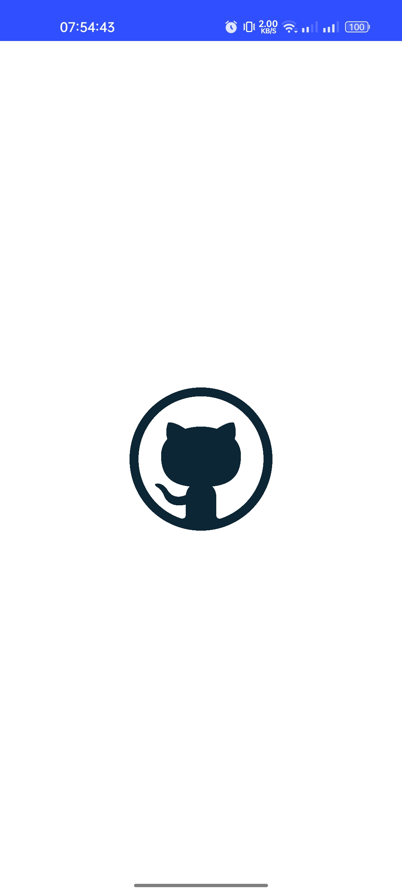
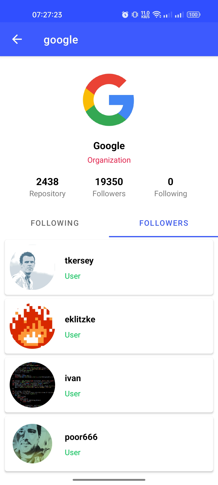
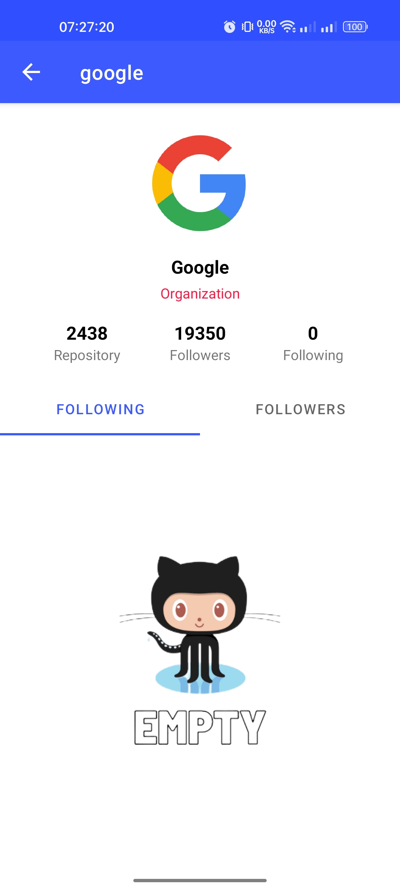
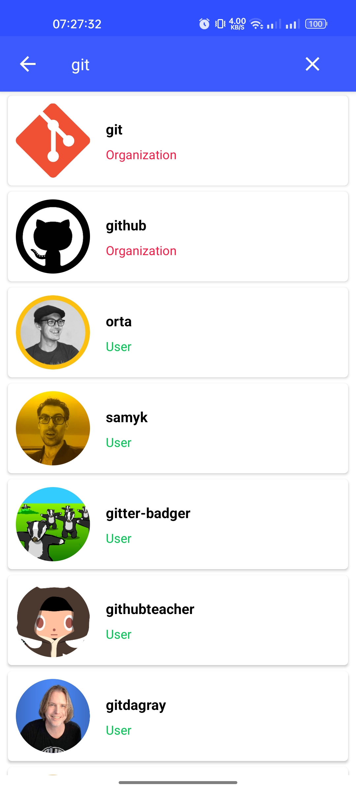

# weGitHub
The First Submission on Belajar Fundamental Aplikasi Android (BFAA) class Dicoding Academy in Bangkit Academy Mobile Development 2023

> **Warning**
> USE THIS PROJECT AS A REFERENCE FOR YOUR SUBMISSION. DO NOT SEND OR COPY PASTE THIS PROJECT FOR YOUR SUBMISSION!

## The First Submission Screenshots :
<table>
    <tr>
        <td>
        <td>
        <td>
    </tr>
    <tr>
        <td>
        <td>
        <td>
    </tr>
<table>
